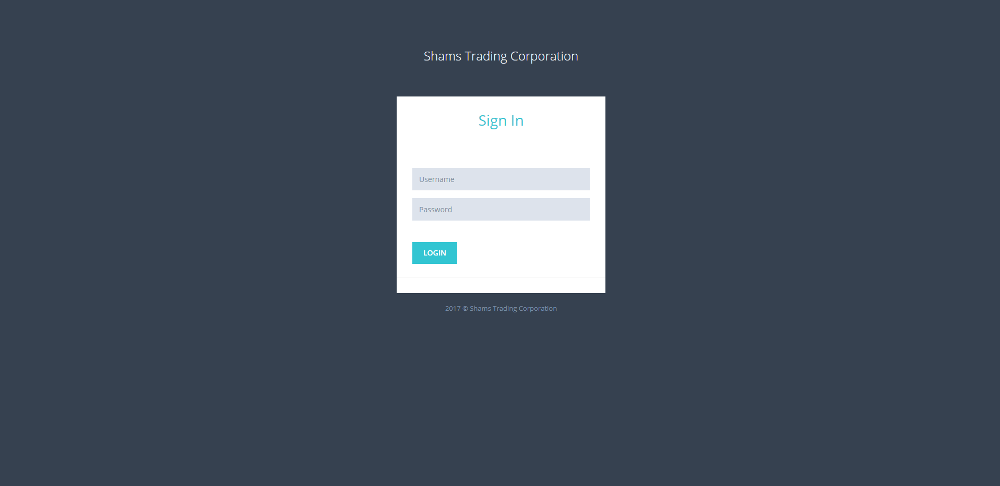

# Fevicol POS System
Fevicol POS System - ASP.NET Web Form
Features
1. Login & Log out
2. Create User
3. Product Order
4. Monye Collect
5. Goods Receive
6. Setting
7. All Report

Tools: 
1. Visual Studio 2015
2. DevExpress
3. SQL SERVER 2019

Installation: if you want to run this project on you pc
1. Resotre Fevicol.bak file to MS SQL Server
2. Change this file Fevicol/Repository/GetWay.cs. Use your Data Source & Password
3. All setup is completed. Let's run it
4. When Login page need user name = ADMIN & password=1234

